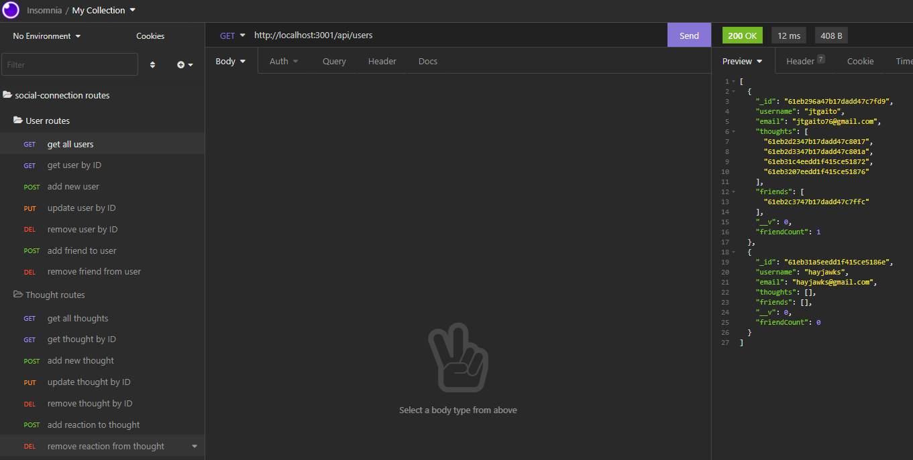

# social-connection

## Description
A back-end code base in which a user can utilize a Mongo database to organize and query information for a social media application.

## Installation
To install this application:
1. Clone repository
1. Download npm dependencies with 'npm install' command

## Usage
To use this application:
1. Invoke application start with 'npm start' command
1. View application functionality through use of Insomia

View this walk-through on application functionality:  
[Demonstration Video](https://watch.screencastify.com/v/0tEKGtWF4yFba3l9rAHm)

## Technologies
- JavaScript
- MongoDB
- Node.js
- Express.js
- Mongoose

## Demo Images
*Preview of Insomnia Demonstration*

## Questions
Reach out to me on GitHub or contact me by email address.  
- [GitHub Profile](https://github.com/kngurley25)  
- kngurley25@gmail.com